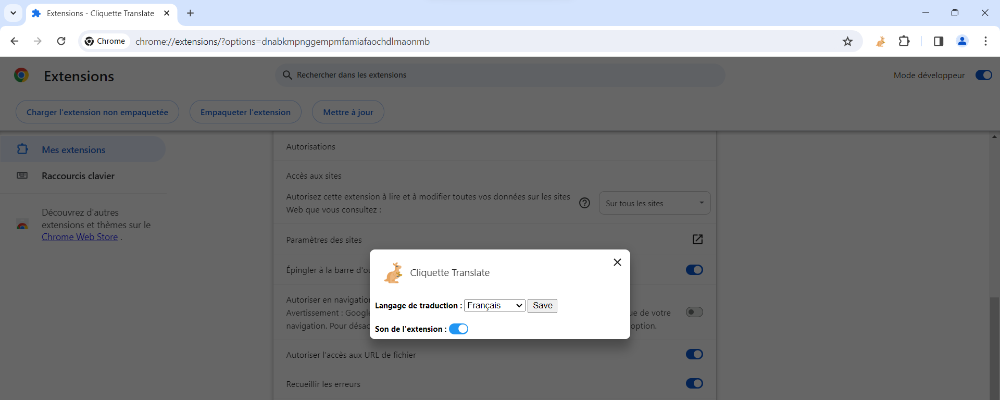
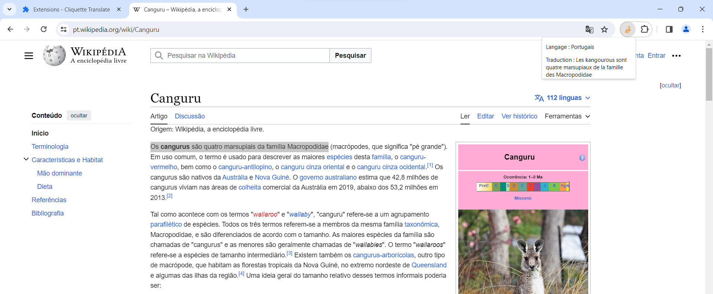

## Projet d'école Ada Tech School : Extension de navigateur

L'idée de base était de faire une extension de traduction anglais-français. 
En sélectionnant un mot dans une page web et cliquant sur l'icône épinglée de l'extension, une popup apparaît avec la traduction en français.

#### Au cours du développement de l'extension, on a élargi les possibilités :
- l'API contient 31 langues : on a laissé la possibilité de traduire toutes ces langues.
- l'API détecte automatiquement la langue du mot sélectionné et l'indique dans les données reçues : on l'affiche dans la popup.
- l'API peut traduire des phrases entières : on n'a pas limité la taille de la sélection.

_

#### On a utilisé plusieurs sources : 

Lien doc google : https://developer.chrome.com/docs/extensions/whats-new?hl=fr
- message-réponse entre popup et content.
- chrome.storage

Lien API : https://www.deepl.com/pro-api
- Utilisation gratuite jusqu'à 500 000 caractères par mois.

Icone : https://www.freepik.com/icon/kangaroo_3809434
- title=kangourou icônes.
- créée par Freepik - Flaticon.

_

#### En plus :
- Pour rigoler, on a mis le son d'un cliquetis de kangourou lors du déclenchement de l'extension.
- On a nommé l'extension par rapport au cliquetis du kangourou et au click pour activer l'extension.
- En option : choisir la langue de traduction.

_

#### On aimerai :
- Migrer l'extension sur Firefox.
- Dans la gestion de l'extension :
- Activer/désactiver le son.

- Mettre le lien vers l'API pour que chaque utilisateur puisse se faire une clé personnelle.

